# LSM Storage Engine

I built a storage engine from scratch, powered by a Log-Structured Merge-Tree (LSM Tree) — the same architecture that drives production databases like RocksDB, LevelDB, Pebble, and BadgerDB.

This document covers the performance benchmarks I ran against the actual implementation under real conditions.

---

## What's Inside

The engine is built around five core components, each solving a specific part of the storage problem:

| Component       | Role                                                      |
| --------------- | --------------------------------------------------------- |
| **WAL**         | Write Ahead Log — guarantees durability before ACK        |
| **SkipList**    | Backs the MemTable — fast in-memory key-value store       |
| **MemTable**    | Active write buffer — absorbs writes before they hit disk |
| **SSTable**     | Immutable sorted file — persistent storage on disk        |
| **Bloom Filter**| Probabilistic filter — eliminates unnecessary disk reads  |

Writes land in memory first and flow to disk asynchronously. Reads check memory before touching disk. This separation is what makes LSM engines fast.

---

## Benchmarks

All benchmarks were executed using:

```bash
go test -bench=. -benchmem
```

## Write Path

The write benchmark measures the full LSM write path from client call to acknowledgment.

```
Client PUT
     ↓
Write Ahead Log (WAL)
     ↓
Active MemTable (SkipList)
     ↓
ACK
```

<p align="center">
  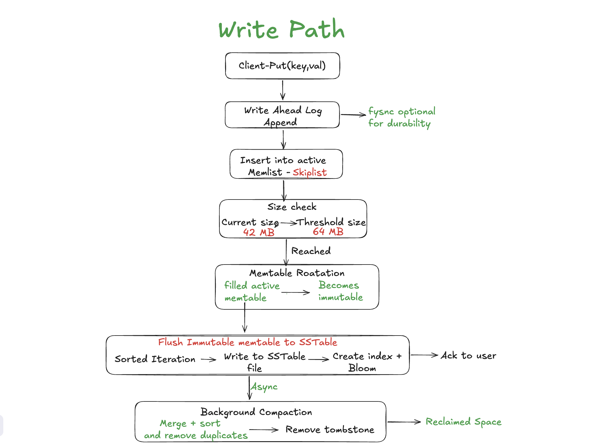
</p>

<p align="center">
  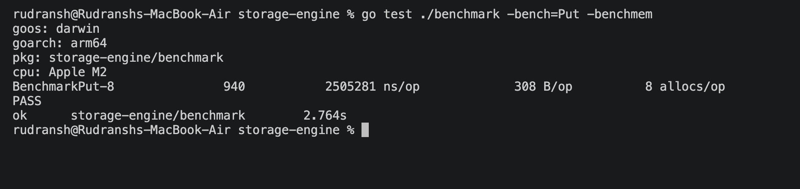
</p>

| Metric      | Value       |
| ----------- | ----------- |
| Operations  | 940         |
| Latency     | 2.50 ms/op  |
| Memory      | 308 B/op    |
| Allocations | 8 allocs/op |

**Observation**

Write latency is dominated by WAL persistence to disk, not SkipList insertion. The SkipList itself is nearly instantaneous — the cost is the durability guarantee. This is the expected tradeoff: memory writes are cheap; making them crash-safe is where time is spent.

---

## SkipList (MemTable)

The MemTable is backed by a SkipList, which provides probabilistic balancing without the overhead of a rebalancing tree.

```
PUT → SkipList Insert
GET → SkipList Search
```

<p align="center">
  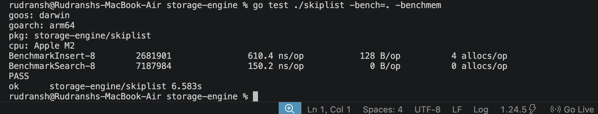
</p>

| Operation | Latency     |
| --------- | ----------- |
| Insert    | 610.4 ns/op |
| Search    | 150.2 ns/op |

**Observation**

At 150 ns per lookup, MemTable reads are effectively free relative to any disk operation. When a key exists in the active MemTable, it is served entirely from memory with negligible latency.

---

## Crash Recovery (WAL Replay)

On startup after a crash, the engine reconstructs the MemTable by replaying the Write Ahead Log:

```
Read WAL
    ↓
Replay Records
    ↓
Rebuild MemTable
```

<p align="center">
  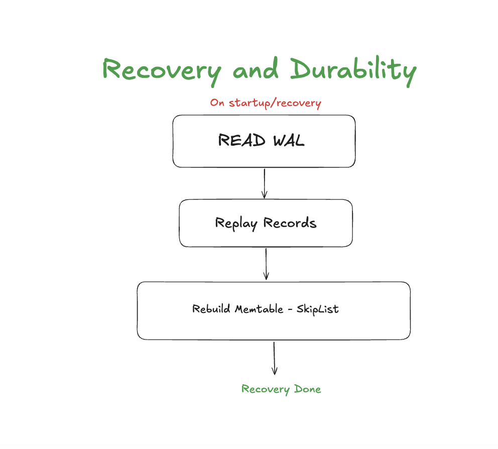
</p>

<p align="center">
  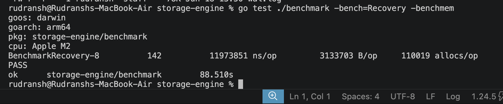
</p>

| Metric      | Value             |
| ----------- | ----------------- |
| Latency     | 11.97 ms/op       |
| Memory      | 3.13 MB/op        |
| Allocations | 110,019 allocs/op |

**Observation**

Recovery time scales linearly with WAL size. The WAL is the authoritative source of truth after a crash — this benchmark confirms the durability model is sound and recovery is bounded by the volume of unflushed writes.

---

## MemTable Rotation

When the active MemTable reaches its configured size threshold, it is sealed and a fresh MemTable is created to accept new writes. The sealed table is then scheduled for background flush.

```
Active MemTable
        ↓
Threshold Reached
        ↓
Sealed → Immutable MemTable
        ↓
New Active MemTable (writes continue)
        ↓
Background Flush
```

<p align="center">
  
</p>

<p align="center">
  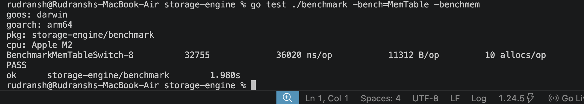
</p>

| Metric      | Value        |
| ----------- | ------------ |
| Latency     | 36.0 µs/op   |
| Memory      | 11.3 KB/op   |
| Allocations | 10 allocs/op |

**Observation**

Rotation is a pointer swap, not a data copy. No records are moved — the active MemTable simply becomes read-only while a new one takes over. At 36 µs, this transition is invisible to the write path.

---

## SSTable Flush

Flushing converts an immutable MemTable into a durable SSTable on disk.

```
Immutable MemTable
         ↓
Sorted Iteration
         ↓
Data Blocks
         ↓
Sparse Index
         ↓
Bloom Filter
         ↓
SSTable File
```

<p align="center">
  
</p>

<p align="center">
  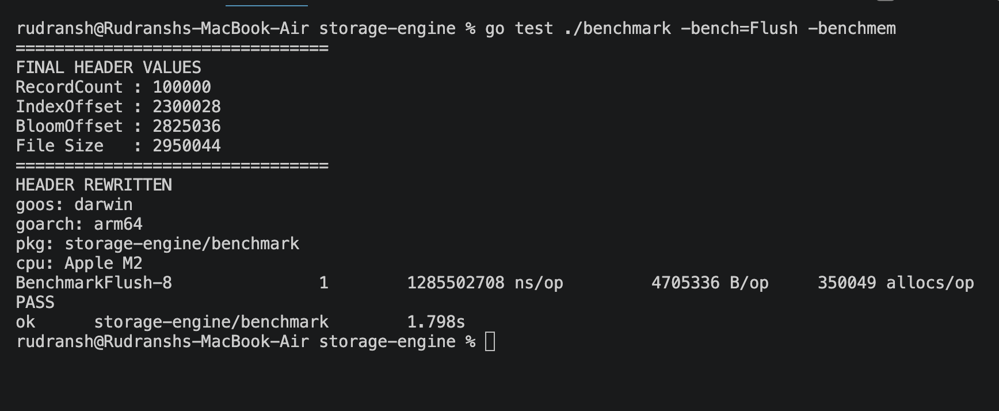
</p>

| Metric      | Value   |
| ----------- | ------- |
| Records     | 100,000 |
| Flush Time  | 1.28 s  |
| Memory      | 4.70 MB |
| Allocations | 350,049 |

**Observation**

Flushing 100,000 records in 1.28 seconds is the most expensive single operation in the engine — it involves sequential file writes, sparse index construction, Bloom filter generation, and metadata encoding. This cost is acceptable because flushing is asynchronous and never blocks the write path.

---

## SSTable Reads

### Without Index — Linear Scan

Reads without index acceleration require scanning data blocks sequentially.

```
SSTable
   ↓
Sequential Scan
   ↓
Target Key
```

<p align="center">
  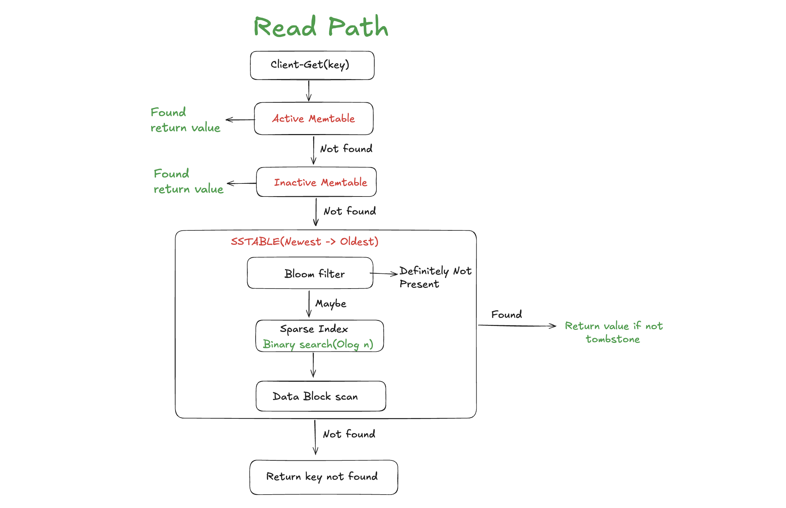
</p>

<p align="center">
  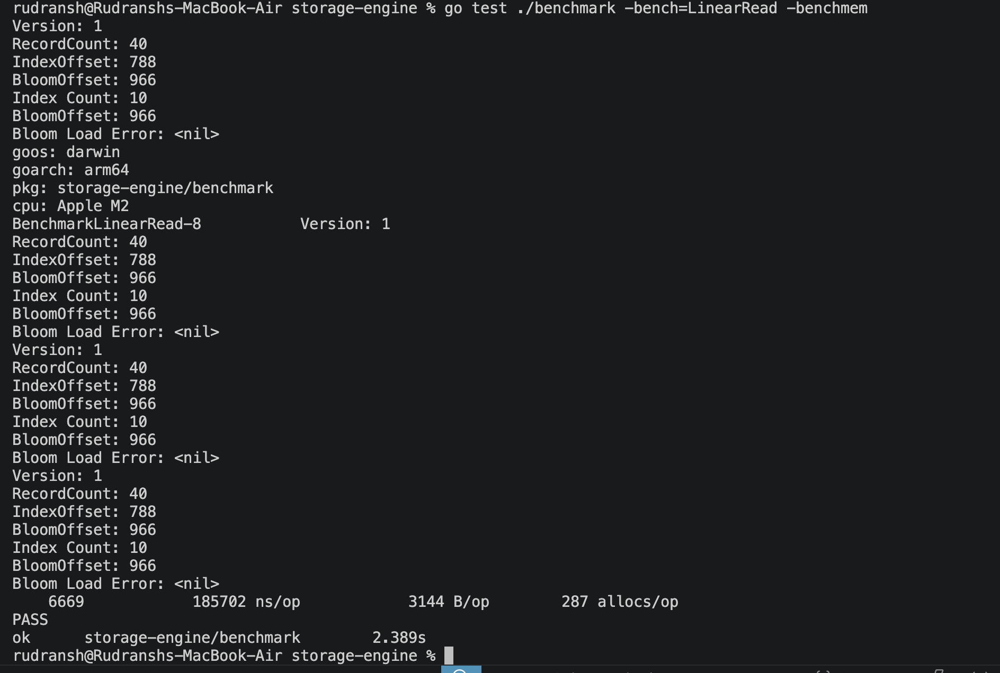
</p>

| Metric      | Value         |
| ----------- | ------------- |
| Latency     | 185.7 µs/op   |
| Memory      | 3144 B/op     |
| Allocations | 287 allocs/op |

Linear scan cost grows with SSTable size. Every lookup may traverse a significant portion of the file.

---

### With Sparse Index — Block-Level Binary Search

The sparse index allows the engine to jump directly to the relevant block rather than scanning from the start.

```
Sparse Index
      ↓
Binary Search → Target Block
      ↓
Block Scan
      ↓
Target Key
```

<p align="center">
  
</p>

<p align="center">
  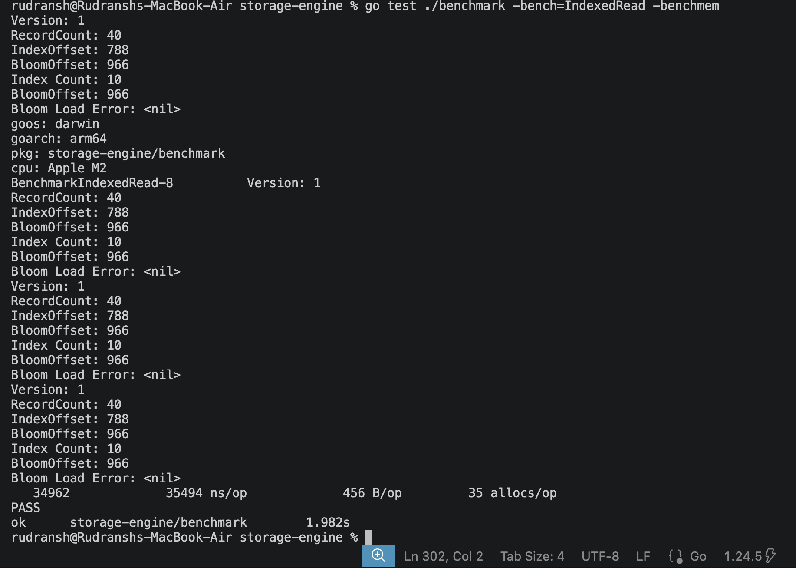
</p>

| Metric      | Value        |
| ----------- | ------------ |
| Latency     | 35.5 µs/op   |
| Memory      | 456 B/op     |
| Allocations | 35 allocs/op |

---

### Linear Scan vs. Sparse Index

| Metric      | Linear Scan | Sparse Index |
| ----------- | ----------- | ------------ |
| Latency     | 185.7 µs    | 35.5 µs      |
| Memory      | 3144 B      | 456 B        |
| Allocations | 287         | 35           |
| **Speedup** |             | **5.2×**     |

**Observation**

The sparse index delivers a 5.2× latency improvement and an 87% reduction in memory allocations. It does not index every key — only one key per block — yet this is sufficient to dramatically narrow the search range. This is the core read optimization for any SSTable-based engine.

---

## Negative Lookups

### Without Bloom Filter

When a key is not present in an SSTable, the engine still traverses the index and inspects the relevant block before concluding absence.

```
Search Index
      ↓
Scan Block
      ↓
Not Found
```

<p align="center">
  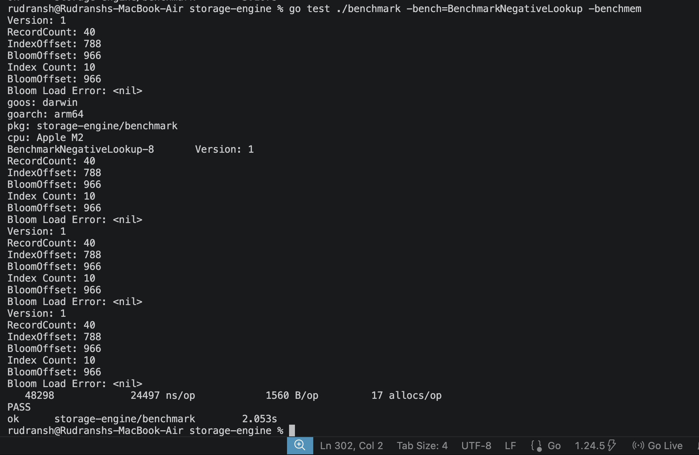
</p>

| Metric      | Value        |
| ----------- | ------------ |
| Latency     | 24.5 µs/op   |
| Memory      | 1560 B/op    |
| Allocations | 17 allocs/op |

---

### With Bloom Filter

A Bloom filter is a probabilistic data structure that answers a single question: *could this key exist here?* If the answer is no, the SSTable is skipped entirely — no index traversal, no block reads.

```
Bloom Filter Check
      ↓
Definitely Not Present → Return
```

<p align="center">
  
</p>

<p align="center">
  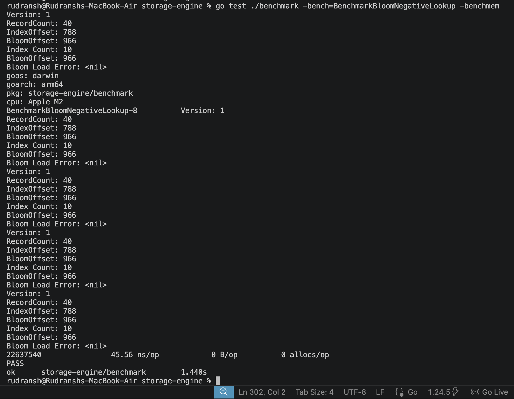
</p>

| Metric      | Value       |
| ----------- | ----------- |
| Latency     | 45.56 ns/op |
| Memory      | 0 B/op      |
| Allocations | 0 allocs/op |

---

### Normal Negative Lookup vs. Bloom Filter

| Metric       | Without Bloom Filter | With Bloom Filter | Improvement |
| ------------ | -------------------- | ----------------- | ----------- |
| Latency      | 24.5 µs              | 45.56 ns          | **537×**    |
| Memory       | 1560 B               | 0 B               | —           |
| Allocations  | 17                   | 0                 | —           |

**Observation**

The Bloom filter is the single largest optimization in the storage engine. A negative lookup drops from 24.5 µs to 45 ns — a 537× improvement — with zero memory allocations. In read-heavy workloads with significant key misses, this directly determines whether the engine scales.

---

## Summary

| Component       | Key Result                    |
| --------------- | ----------------------------- |
| SkipList Insert | 610 ns/op                     |
| SkipList Search | 150 ns/op                     |
| MemTable Rotate | 36 µs/op — zero data movement |
| Sparse Index    | 5.2× faster than linear scan  |
| Bloom Filter    | 537× faster negative lookups  |
| WAL Recovery    | Scales linearly with WAL size |
| SSTable Flush   | 100K records in 1.28 s (async)|

These results validate the fundamental design decisions of a log-structured merge-tree:

- **WAL** provides durability without slowing the write path
- **SkipLists** make MemTable operations nearly free
- **SSTables** offer compact, sorted, persistent storage
- **Sparse Indexes** make reads efficient without full indexing overhead
- **Bloom Filters** eliminate the cost of the most common negative case

The same combination underpins production storage engines including RocksDB, LevelDB, Pebble, and BadgerDB.
